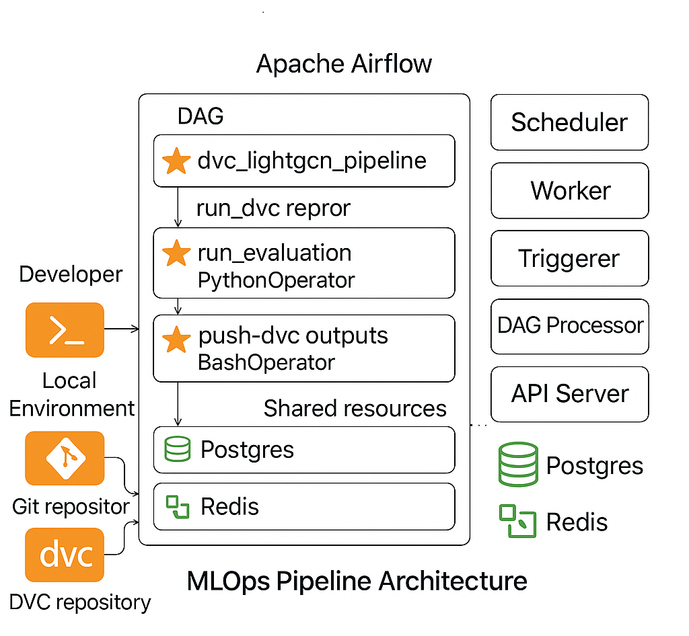

# Fedshi_Assignment

This project builds a **book‑recommendation system** based on the [Book‑Crossing dataset](https://www2.informatik.uni-freiburg.de/~cziegler/BX/) and explores multiple recommendation strategies. The repository contains data cleaning and enrichment notebooks, simple baseline models, a full graph‑based recommender trained with **LightGCN**, and Streamlit dashboards for interactive exploration.


---

## 📁 Repository Overview

### 🔍 Data & Notebooks

- `EDA.ipynb`, `Enrichment.ipynb`, `LightGCN.ipynb`, and `NCF_architecture.ipynb` contain exploratory data analysis, data enrichment, and model experimentation.
- The **enrichment notebook** produces metadata files like:
  - `Enriched_Books_Metadata.csv`
  - `Normalized_Enriched_Metadata.csv`
  - `final_normalized_metadata.csv`

These enriched files capture titles, authors, genres, and ratings information.

- Folders like `clustered_outputs/` and `heatmaps/` contain visualizations and clustering results.
- Raw and processed data: `data/Ratings.csv`, `data/Books.csv`.
- Intermediate results live in the root directory.

---

### 🔸 Baseline Models

####  Popularity-Based Recommender
- Script: `Popularity-Based.py`
- Uses `Streamlit` and `pandas` to show top-rated books by frequency.
- A basic benchmark for evaluating advanced models.

####  Collaborative Filtering
- Notebook: `Collaborative-Filtering.ipynb`
- Stub: `Collaborative-Filtering.py`
- Applies matrix factorization and collaborative filtering to the ratings matrix.

---

## 🔗 LightGCN Recommender System

Located in: `lightgcn-recommender/`

### 🏋️‍♂️ Training Script
- `scripts/train_lightgcn.py`:
  - Loads and splits ratings data.
  - Builds a bipartite interaction graph.
  - Trains a **LightGCN** model with negative sampling.
  - Metrics: `Recall@10`, `NDCG@10`

- Hyperparameters are defined in [`params.yaml`](lightgcn-recommender/params.yaml).

---

### 📦 Data Version Control with DVC
- `dvc.yaml` defines the `train_lightgcn` stage.
  - Dependencies: `data/Ratings.csv`, training script
  - Outputs:
    - `artifacts/embeddings.pt`
    - `models/lightgcn_model.pt`
    - `artifacts/metrics_plot.png`
- `dvc.lock` ensures reproducibility.

---

### 💡 Streamlit Dashboards

#### `scripts/app.py`
- Simple UI for user-based recommendations.
- Loads user embeddings from `artifacts/embeddings.pt`.

#### `scripts/streamlit_dashboard.py`
- Dual-mode UI:
  - User-based recommendation
  - Item-based similarity using cosine similarity on item embeddings
- Displays book info and cover images.

---

### 📊 Evaluation
- Script: `scripts/evaluate.py`
- Saves metrics to `artifacts/metrics.json`
- Customizable for computing `Precision`, `Recall`, `NDCG`, etc.

---

## 🧰 Other Assets

- 📷 **Images**:
  - `NCF.png`, `output.png`, `output2.png`, `output3.png`, `Colabrating Filtering Result.png`

- 📄 **Metadata CSVs**:
  - Enriched and normalized metadata files are pre-included.
  - Regenerable using the enrichment notebook.

- 🗃️ `.dvc/`, `airflow-dvc/`, `artifacts/`, `models/`:
  - Store trained models, pipeline outputs, and cache (not tracked by Git).

---

## ⚙️ Setup

```bash
# Clone the repository
git clone https://github.com/Arashkhajooei/Fedshi_Assignment.git
cd Fedshi_Assignment/lightgcn-recommender

# Install dependencies
pip install -r requirements.txt
```

### Fetch Data (if using DVC)

```bash
dvc pull


# Standard Python script
python scripts/train_lightgcn.py
```
### Or via DVC
```bash
dvc repro train_lightgcn

# Full dashboard (user + item similarity)
streamlit run scripts/app.py

```
